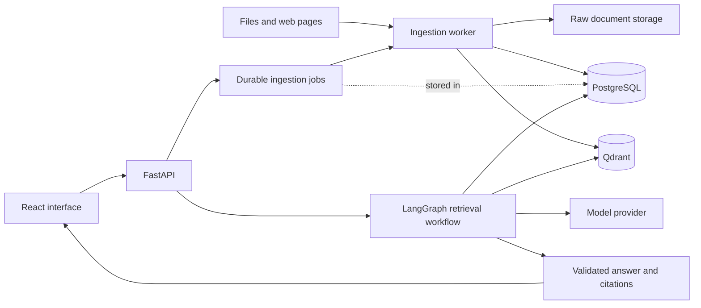

# ContextMesh

**Agentic Knowledge Retrieval Across Any Source**

An extensible Agentic RAG platform for conversational search across documents, websites and enterprise data sources.

**Project status:** architecture and implementation planning. The application has not been implemented yet. This repository defines the proposed first version, its interfaces, and its delivery milestones.

Suggested GitHub repository name: `context-mesh`.

## The experience

Ask: **“What did we decide about the authentication architecture?”**

ContextMesh will select relevant sources, search for evidence, expand its search when evidence is missing, and return an answer with citations. Users will see which sources were searched and why another retrieval round was needed. If the indexed sources cannot support an answer, the system will explain the gap.

In the MVP, those sources are uploaded documents and explicitly added web pages. GitHub, Notion, Slack, and other enterprise connectors follow in later milestones.

## Proposed architecture

A modular monolith with Clean/Hexagonal boundaries, a FastAPI API, and a separate ingestion worker. Both processes share one Python package; ingestion and querying have independent execution paths.

| Responsibility | Initial choice |
| --- | --- |
| UI | React, TypeScript, Vite |
| API and use cases | Python, FastAPI |
| Agent orchestration | LangGraph |
| Metadata, authorization, chat, jobs | PostgreSQL, SQLAlchemy, Alembic |
| Vector retrieval | Qdrant |
| Keyword retrieval | PostgreSQL full-text search |
| Complex document parsing | Unstructured behind a parser interface |
| Raw document storage | Local filesystem adapter; S3-compatible adapter later |
| Chat, embeddings, reranking | Replaceable provider interfaces |
| Development environment | Docker Compose, Python and JavaScript lockfiles |

These are proposed project choices. Dependency versions and model IDs will be pinned and verified during implementation.

## First release scope

- Upload TXT and Markdown first, then text-bearing PDF, DOCX, and PPTX.
- Ingest individual public HTML pages supplied by the user.
- Track ingestion progress, errors, retries, document versions, and deletion.
- Combine vector and keyword results, rerank evidence, and build a bounded context.
- Support conversational questions with source filters, citations, and explicit insufficient-evidence responses.
- Add bounded source selection and search expansion after establishing a conventional RAG baseline.
- Include source ownership checks, retrieval isolation tests, and a reproducible evaluation dataset.

OCR, recursive crawling, enterprise OAuth, live SQL/API tools, and distributed microservices are later extensions.

## Design documents

| Document | Purpose |
| --- | --- |
| [Architecture](docs/architecture.md) | Runtime, module boundaries, data model, ingestion, and agent workflow |
| [Contracts](docs/contracts.md) | Connector and provider interfaces, durable jobs, API shapes, and citations |
| [Implementation roadmap](docs/roadmap.md) | Ordered milestones, dependencies, tasks, and acceptance criteria |
| [Architecture decisions](docs/decisions.md) | Proposed decisions, tradeoffs, and conditions for revisiting them |
| [Quality and evaluation](docs/quality.md) | Access control, failure cases, test strategy, and retrieval evaluation |
| [Implementation agents](docs/agents.md) | Six specialist roles, ownership, and independent architecture review |
| [Engineering rules](docs/engineering.md) | SOLID, pattern selection, automated dependency checks, file and complexity limits |

Start with the architecture, then follow milestones **M1–M5** to reach the MVP. The first implementation milestone is a working development environment and a tested domain/persistence foundation.

## Development agents and checks

Project-scoped Codex roles in `.codex/agents/` cover backend, ingestion, retrieval, frontend, QA, and architecture review. All implementation roles follow SOLID and the documented architecture, with at most **1,000 physical lines per maintained file** and **cyclomatic complexity 4 per function/method**.

Run `make quality-setup`, `make quality`, and `make quality-test` from the repository root. The tooling validates these limits and selected import boundaries; the architecture guardian separately reviews design and behavior. See the [agent workflow](docs/agents.md) and [measurement policy](docs/engineering.md) for details. Application implementation remains planned.

## Portfolio demonstration

Use a synthetic corpus containing an authentication decision record, a platform handbook, and rollout notes. Demonstrate a direct question, a follow-up, an answer that requires a second source, a conflict between document versions, and an unanswerable question. Show citations and measured results against the baseline retrieval system.

All features above describe planned behavior. Runnable setup instructions, screenshots, CI results, and benchmark results will be added when those artifacts exist.
