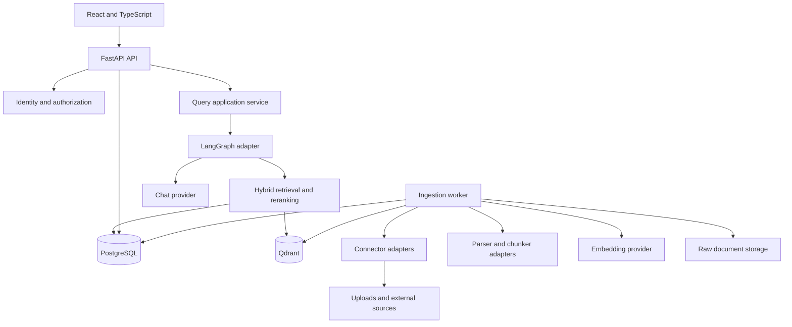
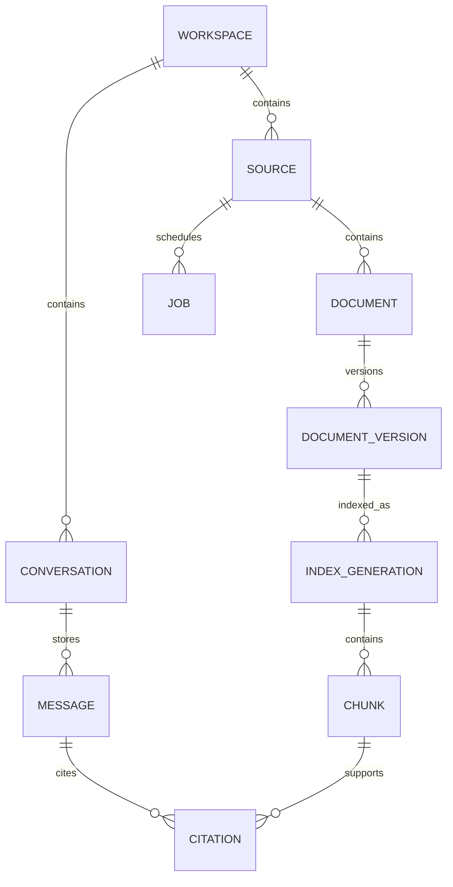
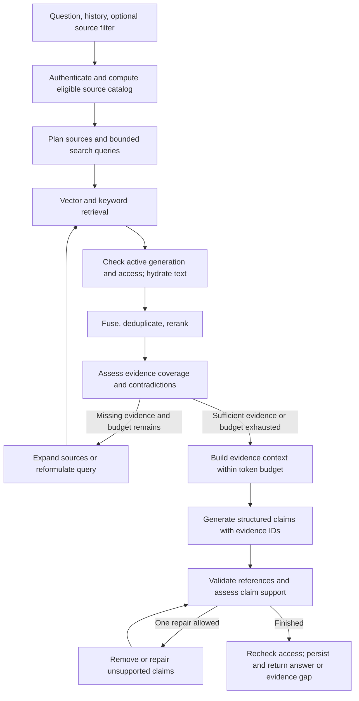

# Proposed architecture

Design date: **2026-10-03**. This document specifies the target implementation; it does not describe existing runtime code.

## Product boundaries

ContextMesh answers questions using evidence from sources the requester may access. Its first release supports indexed retrieval from uploads and individual public web pages. A source can contain many documents; a document can have many immutable versions and chunks.

The agent chooses sources and may expand or reformulate a search. Application policy determines authorization, available tools, budgets, and the conditions under which evidence can be used. Retrieved content cannot change those policies.

The MVP has two application processes:

- **API:** authentication, source management, conversation management, retrieval, and answer generation.
- **Worker:** connector synchronization, parsing, chunking, embedding, indexing, and asynchronous cleanup.

Both use the same codebase and domain contracts. A query reads published indexes and does not wait for parsing or embedding jobs.

## Runtime and stack



| Component | Proposed choice | Responsibility |
| --- | --- | --- |
| Frontend | React + TypeScript + Vite | Chat, source catalog, ingestion progress, evidence viewer |
| API | FastAPI, Python 3.12+ | Validated transport contracts and application entry points |
| Relational persistence | PostgreSQL + SQLAlchemy + Alembic | Canonical metadata, text, permissions, conversations, migrations |
| Vector persistence | Qdrant server | Embeddings and candidate lookup |
| Lexical retrieval | PostgreSQL full-text search | Indexed keyword matching and relevance ranking |
| Workflow | LangGraph | Bounded graph transitions and typed retrieval state |
| Document processing | Unstructured adapter plus lightweight TXT/Markdown parsers | Document elements and location-preserving normalization |
| Background work | PostgreSQL durable job table | Leasing, retries, progress, and recovery |
| Blob storage | Filesystem adapter in development | Original uploads and fetched content; later S3-compatible storage |
| Model integrations | Chat, embedding, and reranker ports | Provider selection without coupling domain objects to SDKs |
| Local infrastructure | Docker Compose | API, worker, frontend, PostgreSQL, Qdrant |

LangGraph supports stateful workflows that combine deterministic and model-driven steps. That makes it suitable for the bounded query workflow proposed here. See the [LangGraph overview](https://docs.langchain.com/oss/python/langgraph/overview).

PostgreSQL provides indexed full-text matching and relevance ranking. Its native text search is the initial lexical engine; this design does not label that ranking as BM25. See [PostgreSQL full-text search](https://www.postgresql.org/docs/current/textsearch-intro.html).

Unstructured exposes document partitioning and element-based chunking. Parser support and operating-system dependencies must be verified for each format before that format is enabled. See [Unstructured's overview](https://docs.unstructured.io/open-source/introduction/overview).

## Code organization and dependency rules

The following tree is a **planned layout**, not directories already containing application code:

```text
context-mesh/
  backend/
    pyproject.toml
    src/context_mesh/
      domain/                 # Entities, value objects, policy invariants
      application/
        ports/                # Storage, models, search, connectors, jobs
        sources/              # Register, sync, upload, delete
        ingestion/            # Normalize, chunk, index, publish
        retrieval/            # Search, fuse, rerank, context building
        conversations/        # Turns, history, query execution
        answers/              # Claims, evidence, validation
      adapters/
        inbound/http/         # FastAPI routes, auth, request/response schemas
        inbound/worker/       # Job consumer entry point
        outbound/connectors/  # Upload, website, later enterprise adapters
        outbound/parsers/     # Text, Markdown, Unstructured
        outbound/persistence/ # PostgreSQL repositories and migrations
        outbound/search/      # Qdrant and PostgreSQL lexical adapters
        outbound/models/      # Chat, embedding, reranker implementations
        outbound/storage/     # Filesystem, later S3-compatible adapter
        orchestration/        # LangGraph workflow implementation
      bootstrap/              # Settings and dependency composition
    tests/
      unit/
      integration/
      e2e/
  frontend/
    src/features/{chat,sources,evidence}/
  evals/                      # Corpus, judgments, runner, benchmark reports
  infra/                      # Compose and container definitions
  docs/
```

Dependency direction is `adapters -> application -> domain`. Domain objects do not import FastAPI, LangGraph, SQLAlchemy, Qdrant, or provider SDKs. The application defines the ports; adapters implement them. The composition root wires API and worker dependencies explicitly.

LangGraph calls application services rather than database clients directly. Ingestion and query modules communicate through published storage and typed contracts, not through HTTP calls to one another.

## Canonical data model

| Entity | Key fields and purpose |
| --- | --- |
| Workspace | `id`; tenant boundary, even if development has one workspace |
| Membership | `workspace_id`, authenticated subject, role |
| Source | `id`, workspace, kind, name, configuration, owner, visibility, lifecycle generation, sync state |
| Credential reference | Secret-store reference for a connector; never returned in source responses |
| Document | `id`, source, stable external ID, current published index reference, deletion state |
| Document version | Immutable content version, raw blob key, content hash, source revision, timestamps, normalized elements |
| Index generation | Document version, parser/chunker/embedding signature, expected chunk count, publication state |
| Chunk | Stable UUID, index generation, ordinal, text, token count, heading and location |
| Access grant | Resource, principal, permission, current ACL revision; workspace/source-level grants in MVP |
| Job | Typed event, idempotency key, stage, attempts, lease/fencing token, next retry, safe error |
| Sync run | Source, bounded scan, input cursor, pending checkpoint, terminal state |
| Conversation / message | Workspace, requester, question, answer, evidence references, turn state |
| Query trace | Stage summaries, selected source IDs, timings, counts, model usage, policy version |

Relationships:



Content versions and index generations are separate: changing a chunker or embedding model requires a new index generation without pretending the source content changed. Store the provider, model, dimensions, parser revision, chunker revision, and normalization revision in the pipeline signature.

Use deterministic UUID point IDs derived from document ID, content version, pipeline signature, and chunk ordinal. Do not deduplicate across workspaces in a way that reveals another workspace's content.

PostgreSQL is authoritative for visibility, permissions, published generations, and citation text. Qdrant payloads contain identifiers and filter metadata; canonical chunk text remains in PostgreSQL. A stale vector candidate must never be enough to disclose content.

## Ingestion flow

```mermaid
sequenceDiagram
    participant U as User
    participant A as API
    participant B as Blob storage
    participant P as PostgreSQL
    participant W as Worker
    participant E as Embedding provider
    participant Q as Qdrant
    U->>A: Upload file or request source sync
    A->>B: Save upload, if present
    A->>P: Commit source/document changes and durable job
    A-->>U: Job ID and accepted status
    W->>P: Claim job with lease and fencing token
    W->>B: Read or persist connector content
    W->>W: Parse, normalize, chunk, preserve locators
    W->>P: Stage immutable version and index generation
    W->>E: Embed bounded batches
    W->>Q: Upsert deterministic points; await completion
    W->>P: Publish generation if lease and lifecycle are current
    W->>P: Finish job and schedule obsolete-index cleanup
```

1. **Acquire:** validate source scope and limits; save uploads or fetch an explicitly configured URL. Persist raw content before processing. Blob keys are server-generated, not user-controlled paths.
2. **Parse:** use format-specific adapters. TXT/Markdown start the first vertical slice. Add text-bearing PDF, DOCX, and PPTX with fixtures. Scanned PDFs initially return `ocr_required` rather than silently indexing empty content.
3. **Normalize:** preserve titles, headings, pages/slides, tables, source URI, source revision, and timestamps. Normalize whitespace without discarding location information.
4. **Chunk:** start with heading-aware chunks around 600 tokens and up to 100 tokens of overlap. These are tunable defaults; enforce provider token limits. Record chunk-to-element mappings for citations.
5. **Embed:** batch through the embedding port. Retry transient provider failures. A deterministic fake is acceptable for tests and a clearly labeled demo; semantic evaluation requires real embeddings.
6. **Stage and index:** store chunks in a pending PostgreSQL generation and upsert their Qdrant points. Verify the expected writes before publication.
7. **Publish:** atomically update the document's active generation only if the source lifecycle, requested document revision, pipeline target, and worker fencing token still match. Both lexical and vector candidate hydration require this published generation.
8. **Clean up:** delete obsolete vector points asynchronously and retain historical evidence according to the retention policy. Sweep old unreferenced blobs left by failed registration transactions.

The previous published generation stays readable during a reindex. A failed first ingestion leaves the document unavailable. Failed indexing cannot publish partial chunks. Deletion or access revocation takes effect in canonical metadata immediately, while physical cleanup continues in the worker.

### Durable jobs and consistency

Insert a job in the same PostgreSQL transaction as the corresponding domain change. The job row is the initial durable event delivery mechanism; the worker polls for committed jobs. This avoids an API-commit/message-publish gap and keeps the MVP infrastructure small.

Claim due work in a short transaction using `FOR UPDATE SKIP LOCKED`, set a lease and a monotonically increasing fencing token, and release the transaction before parsing or network calls. PostgreSQL documents this lock mode as useful for competing consumers of a queue-like table. See the [SELECT locking clause](https://www.postgresql.org/docs/current/sql-select.html#SQL-FOR-UPDATE-SHARE).

Use heartbeats, expired-lease recovery, bounded retries with jitter, and terminal failures. All handlers are idempotent. Worker completion and canonical publication use compare-and-set checks on the lease token and lifecycle generation. A replaced worker may leave orphan vector writes, but cannot publish an obsolete generation.

PostgreSQL and Qdrant do not share a transaction. Treat Qdrant as a rebuildable projection. Canonical publication, generation checks during candidate hydration, retryable cleanup, and a reconciliation job provide recovery. Stale vector results may reduce recall until reconciliation; they must not expose stale or inaccessible text. Bound overfetching and fall back to authorized lexical retrieval when necessary.

## Query flow and agent behavior



The graph uses typed state: request identity, normalized question, eligible/selected/searched source IDs, search variants, retrieval rounds, authorized evidence IDs, coverage gaps, context tokens, draft claims, validation findings, and a public stage trace. Credentials and hidden model reasoning are excluded.

### Establish a baseline first

The baseline searches all eligible sources in the user-selected scope. Retrieve up to 50 vector and 50 lexical candidates per round, apply canonical visibility checks, fuse the ranked lists, rerank at most 20 authorized chunks, and pass roughly 6–10 chunks to the context builder. Use configurable limits and an explicit context token budget.

Use reciprocal rank fusion in the application layer because the initial ranked lists come from different stores. For ranks starting at 1, start with `score(chunk) = sum(1 / (60 + rank_in_list))`; a missing rank contributes zero. RRF combines ranks rather than adding incomparable raw scores. Qdrant also documents RRF and native hybrid queries for a possible later sparse-vector adapter. See [Qdrant hybrid queries](https://qdrant.tech/documentation/search/hybrid-queries/).

Apply workspace and eligible-source filters to vector lookup. Qdrant supports Boolean combinations of payload conditions; see [Qdrant filtering](https://qdrant.tech/documentation/search/filtering/). Recheck every returned candidate against current PostgreSQL visibility before hydrating text or sending it to any reranker or generation model.

### Add the agent loop

The planner sees only an authorized catalog of source IDs, descriptions, document types, and freshness. It selects existing IDs through structured output. The server rejects unknown IDs and intersects selections with the user's explicit source filter.

An evidence assessor identifies missing subquestions and contradictory passages. Search expansion is allowed when coverage is incomplete; a similarity score alone does not establish sufficiency. Combine deterministic checks with a structured model assessment, and calibrate decisions on the evaluation corpus.

Initial execution limits are **three retrieval rounds, two query variants per round, one answer repair, and a 30-second query deadline**. Enforce a configurable token/cost budget as well. These are starting policies, not measured performance guarantees. If a limit is reached, return a supported partial answer or an evidence-gap response.

Example: a future GitHub/Notion/Slack query might search architecture notes first, then expand to a discussion source to resolve an open question. In the MVP the same behavior is demonstrated across uploaded decision records, handbooks, and web pages; enterprise connectors are not simulated as working integrations.

### Answer and citation behavior

Generate structured claims that cite evidence IDs supplied by the context builder. Construct source titles, URLs, page/slide locators, snippets, and document-version references from canonical records. The model does not invent those fields.

Validation has two distinct responsibilities:

- **Reference validity:** each citation exists in the supplied evidence, its location/version matches, and the requester can still access it. These checks are deterministic.
- **Claim support:** cited passages support the claim, scope, and wording. A structured model assessment can help, but it is fallible and is measured against human judgments. Valid citation IDs alone do not prove factual correctness.

After one repair, unsupported claims are removed. If useful supported claims remain, return `partial` with explicit gaps; otherwise return `insufficient_evidence`. Preserve conflicting evidence rather than inventing agreement. Recheck current authorization before releasing the final answer and when reading saved history or citation excerpts.

Keep conversation history scoped to its requester. Resolve follow-ups into a standalone retrieval question; previous assistant messages are conversation context, not primary evidence. Persist messages and final traces first. Add durable LangGraph checkpoints when resuming long-running queries becomes a concrete requirement.

For the MVP, streaming exposes stage events followed by one validated answer. Draft tokens are buffered until validation so that unsupported claims are not released before the checks run. Stage summaries describe actions and evidence gaps, not private chain-of-thought.

## Access, ingestion, and tool boundaries

Development may use a fixed server-side identity on localhost. Before shared deployment, validate OIDC issuer/audience/signatures, require workspace membership, and enforce current grants throughout retrieval and evidence endpoints. A client-supplied workspace ID is never trusted as authorization.

MVP uploads and websites inherit source-level grants. Enterprise document-level permissions and freshness/revocation policies must be implemented before private enterprise content is enabled. Previously saved answers must not bypass current permissions; withhold an answer whose required evidence is no longer visible.

Website ingestion is a worker operation with bounded size, timeout, redirects, and allowed MIME types. Block private, loopback, link-local, and metadata endpoints. Enforce destination checks at connection time and after redirects through a controlled resolver/egress layer; validating a URL string or resolving DNS once is insufficient.

Live SQL, arbitrary REST calls, and source mutation are outside the MVP tool set. A later live-tool milestone requires registered read-only capabilities, server-side argument validation, resource allowlists, and the same authorization boundary as indexed retrieval.

## Evolution and operating signals

Start with one worker pool and explicit concurrency/provider limits. Measure queue age, ingestion throughput, retry rate, publication failures, index drift, retrieval rounds, authorized candidate yield, citation support, latency, and model usage. Logs use request/job IDs and safe error codes; source content and credentials are excluded by default.

Add a broker, dedicated OCR workers, additional lexical engines, or separate services when measured load or operational ownership justifies them. Record each change in an architecture decision and keep the canonical contracts stable. See the [decision log](decisions.md), [roadmap](roadmap.md), and [quality gates](quality.md).
