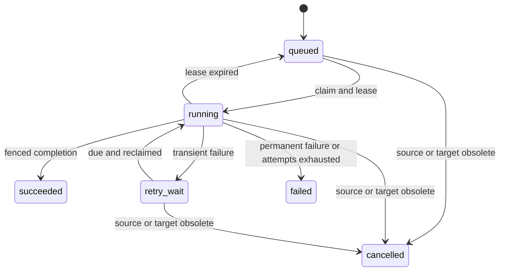

# Proposed contracts

These are implementation targets, not callable endpoints or shipped SDKs. Use them to align the backend, frontend, worker, and evaluation harness. HTTP schemas should eventually generate the OpenAPI contract; domain contracts should remain independent of transport and provider SDKs.

## Shared vocabulary

All resources carry a server-assigned workspace boundary. Public IDs are opaque UUIDs. External IDs are stable identifiers within a particular source. Timestamps are UTC; source-provided timestamps are distinguished from ingestion timestamps.

| Type | Minimum fields |
| --- | --- |
| RequestContext | Authenticated subject, workspace membership, roles, request ID, deadline |
| SourceSpec | Source ID, kind, configuration, credential reference, lifecycle generation |
| Change | External ID, operation, upstream revision, changed-at timestamp, metadata |
| ChangePage | Changes, proposed next checkpoint, complete-scan marker |
| RawDocument | Source/external IDs, revision, title, MIME type, blob reference, content hash, source URI, ACL information |
| NormalizedDocument | Raw identity, parser revision, text elements, locations, language, metadata |
| Element | Text, type, heading path, page/slide or other source locator |
| Chunk | Chunk UUID, document/version/index IDs, ordinal, text, token count, element locations |
| SearchScope | Workspace, eligible source IDs, current access policy, optional document/time filters |
| Candidate | Chunk ID, engine, engine rank and score; no trusted authorization decision |
| Evidence | Authorized canonical chunk, source/title/location, published generation, retrieval ranks |
| Claim | Claim ID, text, cited evidence IDs |
| ValidationReport | Reference findings, claim-support findings, remaining gaps |

Do not overwrite content when only a pipeline configuration changes: a document version identifies content, and an index generation identifies a processing configuration. Store upstream revisions separately from internal version IDs.

## Connector protocol

Each connector publishes its capabilities and implements bounded discovery and content acquisition. Conceptual signatures:

```text
capabilities() -> ConnectorCapabilities
scan(source, checkpoint, limits) -> asynchronous pages of Change
fetch(source, change, limits) -> RawDocument
check_connection(source) -> ConnectionCheck
```

Capabilities describe incremental sync, authoritative full scans, deletions, upstream permissions, and immutable revision fetching. Unsupported capabilities are explicit. The registry controls which implementations may be instantiated; the planner cannot construct a connector or execute arbitrary provider calls.

Supported source kinds for the MVP:

- `upload`: server-managed files, grouped into an upload source; document identity persists across replacements.
- `website`: a configured individual public page; canonical URLs and redirects are validated by the fetch layer.

Future kinds include GitHub, Notion, Slack, Drive, Confluence, S3-compatible storage, and registered API/database sources. A source is an instance of a connector, such as one GitHub repository or one upload collection.

### Synchronization rules

1. Discover changes through bounded pagination. Persist document identities, proposed versions, and child jobs before advancing the checkpoint.
2. A committed checkpoint means every discovered change is durably represented. It does not mean indexing has finished. Expose discovery and indexing progress separately.
3. Replaying a page is safe: source ID, external ID, upstream revision/content hash, and pipeline target identify the logical indexing work.
4. If an upstream revision cannot be fetched consistently, rediscover it; do not attach newer content to an older revision label.
5. Apply permission revocations and deletion tombstones to canonical records before asynchronous vector cleanup.
6. A missing item may be treated as deleted only after a successful, complete, authoritative scan of the same scope. Failed or partial pagination cannot imply deletion.
7. Preserve rate-limit information and use provider-directed retry delays where available. Distinguish expired credentials from transient network failures.
8. A content hash match may skip embeddings, but must not skip permission, title, URI, or freshness updates.

The fetch adapter resolves credentials through a secret reference. Secrets are never placed in raw-document metadata, job payloads, Qdrant payloads, model prompts, or user-facing traces.

## Application ports

| Port | Responsibilities and invariants |
| --- | --- |
| SourceRepository / DocumentRepository | Scoped reads, immutable versions, active-generation compare-and-set, tombstones |
| AuthorizationService | Current membership/grants; authoritative checks before content hydration and release |
| UnitOfWork | Atomic canonical changes and durable job insertion |
| BlobStore | Bounded reads/writes by opaque keys; deletion; backend-independent handles |
| JobQueue | Enqueue, claim, heartbeat, update progress, finish/fail using fencing tokens |
| Parser | Raw content to elements with preserved locations; explicit format and OCR failures |
| Chunker | Elements to bounded chunks; deterministic output for a pipeline signature |
| EmbeddingProvider | Batch texts to vectors; expose model identity, vector dimensions, token limits |
| VectorIndex | Upsert/delete/query identifiers within server-provided scope; wait for requested writes |
| LexicalSearch | Authorized published-generation keyword candidates; indexed query execution |
| Reranker | Rank already authorized evidence; expose provider/model identity and usage |
| ChatModel | Structured planning, evidence assessment, claim generation, and support assessment |
| ConversationRepository | Requester-scoped history and idempotent turn state transitions |
| Clock / UsageRecorder | Deadlines, budgets, stage timings, tokens, and estimated provider costs |

The same embedding pipeline embeds indexed chunks and retrieval questions. Reject dimension mismatches and incompatible pipeline identities. Model changes create a new index generation/collection target and require reindexing before activation.

The first reranker can be deterministic and inexpensive; a model-based adapter is added and benchmarked separately. Record the reranker used in every evaluation so its contribution is not confused with source planning.

## Durable job envelope

Internal example, with abbreviated IDs for readability:

```json
{
  "event_id": "event-uuid",
  "schema_version": 1,
  "type": "document.index_requested",
  "workspace_id": "workspace-uuid",
  "source_id": "source-uuid",
  "source_generation": 3,
  "document_id": "document-uuid",
  "document_version_id": "version-uuid",
  "pipeline_signature": "parser-v1:chunker-v1:embedding-config-v1",
  "idempotency_key": "document-uuid:version-uuid:embedding-config-v1:chunker-v1:parser-v1",
  "trace_id": "request-uuid",
  "occurred_at": "2026-10-03T12:00:00Z"
}
```

No raw document text or credentials belong in this envelope. Store delivery state separately: attempts, next-attempt timestamp, lease owner, lease deadline, fencing token, progress stage, and safe error fields.

Initial job types are `source.sync_requested`, `document.index_requested`, `document.delete_requested`, `source.delete_requested`, and `index.reconcile_requested`.

Job states:



Start with a 90-second lease renewed every 20 seconds and at most five automatic attempts, with exponential backoff and jitter. Clamp provider calls to the remaining lease/deadline or renew while they run. These defaults need failure testing and tuning for large documents.

Compare source lifecycle generation, desired content version, pipeline target, and the live job fencing token before canonical publication. Replacing source configuration or deleting a source invalidates prior work. Do not keep database locks open during parsing or network calls.

Public job status reports safe progress, attempt count, and actionable error codes. It does not disclose internal storage keys, secret references, stack traces, or another workspace's identifiers.

## Proposed HTTP API

Base path: `/api/v1`. Authentication derives the subject and workspace; client input cannot override it. Cursor pagination applies to collection endpoints. The table specifies the intended contracts; streaming is introduced in M5.

| Method and path | Result | Notes |
| --- | --- | --- |
| `GET /health/live` | `200` when process runs | No source/model details |
| `GET /health/ready` | `200` or `503` | Check configured dependencies; model access is a separate diagnostic |
| `GET /api/v1/sources` | `200`, visible sources | Include sync state, document counts, and last successful sync |
| `POST /api/v1/sources` | `201`, source | Register `upload` collection or configured `website`; no implicit indexing |
| `POST /api/v1/sources/{id}/documents` | `202`, document and job IDs | Multipart upload to an `upload` source |
| `POST /api/v1/sources/{id}/sync` | `202`, sync job | Only for connectors with scan support |
| `DELETE /api/v1/sources/{id}` | `202`, cleanup job | Revoke visibility immediately; physical deletion is asynchronous |
| `GET /api/v1/jobs/{id}` | `200`, public job status | Authorize workspace and resource access |
| `POST /api/v1/documents/{id}/reindex` | `202`, job | Reprocess current content with the selected pipeline target |
| `DELETE /api/v1/documents/{id}` | `202`, cleanup job | Tombstone immediately |
| `GET /api/v1/documents/{id}/versions/{version}/evidence` | `200`, authorized excerpt | Bound range/size; current grants and retention apply |
| `POST /api/v1/conversations` | `201`, conversation | Requester-scoped conversation |
| `GET /api/v1/conversations` | `200`, own conversations | No cross-user history |
| `GET /api/v1/conversations/{id}/messages` | `200`, authorized history | Recheck evidence visibility; withhold inaccessible answers |
| `POST /api/v1/conversations/{id}/messages` | `200`, completed answer | Bounded synchronous query; `Idempotency-Key` required |
| `POST /api/v1/conversations/{id}/messages/stream` | SSE | Same turn semantics; progress then validated final result |

Registering and synchronizing a website are separate operations so the interface can show configuration errors before fetching. Upload processing and synchronization return `202`; the final ingestion outcome is observed through the job endpoint.

Mutating ingestion requests accept an `Idempotency-Key` scoped to subject, workspace, route, and payload hash. Repeating the same request returns the original resource/job. A reused key with different input returns `409`. Chat turns use the same rule: completed retries return the saved authorized result; an already running turn returns `409 turn_in_progress`. A crashed turn is marked interrupted and can be explicitly retried without duplicating the visible user message.

### Question request

```json
{
  "message": "What did we decide about the authentication architecture?",
  "source_ids": ["source-uuid-a", "source-uuid-b"]
}
```

An omitted `source_ids` selects all sources eligible for the requester. An empty array is invalid; it must never silently broaden to all sources. A supplied filter is a hard upper bound throughout the agent loop. Inaccessible or nonexistent resource IDs return the same `404` response. All planner/tool arguments are validated against server-derived scope.

### Answer response

Illustrative response, not a claim about a real team's decisions:

```json
{
  "message_id": "message-uuid",
  "status": "answered",
  "answer": "The decision record selects OIDC with a central identity provider. [1]",
  "claims": [
    {
      "id": "claim-1",
      "text": "The decision record selects OIDC with a central identity provider.",
      "citation_ids": ["citation-1"]
    }
  ],
  "citations": [
    {
      "id": "citation-1",
      "number": 1,
      "source_id": "source-uuid-a",
      "document_id": "document-uuid",
      "document_version_id": "version-uuid",
      "index_generation_id": "index-uuid",
      "chunk_id": "chunk-uuid",
      "title": "Authentication architecture — ADR 004",
      "locator": {"heading_path": ["Decision"], "page": null, "slide": null},
      "snippet": "Use OIDC with a central identity provider for authentication.",
      "evidence_path": "/api/v1/documents/document-uuid/versions/version-uuid/evidence?chunk_id=chunk-uuid",
      "source_url": null
    }
  ],
  "gaps": [],
  "trace": [
    {"stage": "plan", "summary": "Selected two architecture sources."},
    {"stage": "retrieve", "summary": "Retrieved and checked published evidence."},
    {"stage": "validate", "summary": "Checked citation references and assessed claim support."}
  ]
}
```

The server derives display text and citation numbering from validated claims. Claims reference citation IDs; citations reference canonical chunks and immutable versions. Snippets and locators come from stored evidence rather than model output. Source URLs are optional and scheme-validated; uploaded files use an authenticated evidence path instead of a local filesystem path.

Answer statuses are `answered`, `partial`, and `insufficient_evidence`. The last status has no unsupported factual answer and explains the missing evidence. Dependency failures are reported as failures, not converted into a misleading evidence-gap answer.

SSE events are `turn_started`, `stage`, `answer`, and `error`. Stages carry public action summaries; the final `answer` carries this response object after validation. A stream uses a stable turn ID; a reconnect can read saved state and must not start a second model run implicitly. If access changed before replay, withhold inaccessible content.

### Error shape

```json
{
  "error": {
    "code": "unsupported_media_type",
    "message": "This file type is not enabled for ingestion.",
    "request_id": "request-uuid",
    "retryable": false
  }
}
```

Use `401` for missing/invalid authentication, `403` for an authenticated operation without the required role, `404` for unavailable resources, `409` for conflicting operations/idempotency, `413` for size limits, `415` for an unsupported upload type, `422` for invalid input, `429` for request limits, and `503` for unavailable dependencies. An asynchronous parser failure is represented by a failed job, not a retroactive HTTP error on the accepted upload.

## Versioning and extension rules

- Version public APIs by path and internal event schemas by envelope version.
- Consumers reject unsupported event versions with a terminal, inspectable error.
- New connectors implement the same normalized content and authorization contracts; they do not add provider-specific branches to core retrieval.
- Additional retrieval adapters return ranked candidates. Application-level visibility checks, fusion, evidence building, and citations remain common.
- Live-tool results must acquire normalized evidence identity and provenance before they can support a claim; this extension is disabled until its own milestone is complete.
